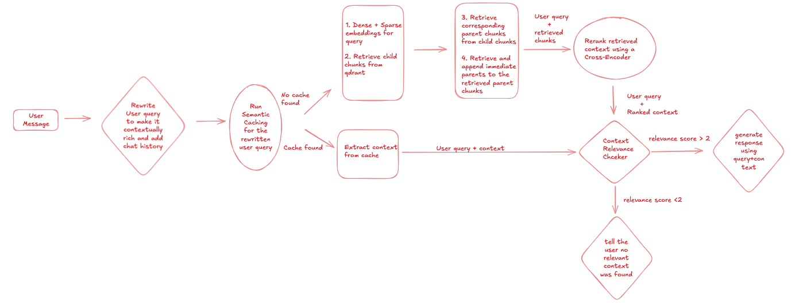

# Hybrid RAG Pipeline with Semantic Cache
A detailed overview for this application can be found here: 
[Detailed Overview of the application](https://app.devin.ai/wiki/sanafayyaz315/hybrid-rag)


## Overview



This project implements a **Hybrid Retrieval-Augmented Generation (RAG) pipeline** enhanced with **Semantic Caching** for efficient query handling.

The pipeline combines:
- **Query Rewriting** to add contextual richness and preserve chat history.  
- **Semantic Cache** to avoid redundant retrieval when a similar query was already processed.  
- **Hybrid Retrieval (dense + sparse)** to fetch both semantic and keyword-based relevant chunks.  
- **Hierarchical Retrieval** (child chunks → parent chunks → immediate parents).  
- **Cross-Encoder Re-ranking** to refine retrieved context.  
- **Context Relevance Checking** to ensure high-quality responses.  
- **LLM-based Response Generation** to produce accurate and context-aware answers.  

---

## Workflow
The pipeline follows these steps:

1. **User Message → Query Rewriting**  
   - User query is rewritten to include context and chat history, making it more informative.  

2. **Semantic Cache Check**  
   - The rewritten query is checked against the **Redis Semantic Cache**.  
   - If a **cache hit** is found → Extract context from cache.  
   - If no cache entry → Proceed to retrieval.  

3. **Hybrid Retrieval**  
   - Compute **dense + sparse embeddings** for the query.  
   - Retrieve **child chunks** from **Qdrant (vectorstore)**.  
   - Retrieve **corresponding parent chunks** from **PostgreSQL (docstore)**.  
   - Append **immediate parent/neighboring chunks** for additional context.  

4. **Re-ranking**  
   - Retrieved chunks are **re-ranked** with a **Cross-Encoder** model to prioritize the most relevant context.  

5. **Context Relevance Checking**  
   - If the **relevance score > 2** → Proceed to response generation.  
   - If **relevance score ≤ 2** → Inform the user that no relevant context was found.  

6. **Response Generation**  
   - Final response is generated using **OpenAI** with the user query + selected context.  

---

## Key Features
- **Semantic Cache with RedisVL**  
  - Prevents duplicate retrieval for semantically similar queries.  
  - Reduces latency and computation cost.  

- **Hybrid Retrieval**  
  - Combines **dense embeddings (semantic similarity via FastEmbed)** and **sparse retrieval (BM25)** for robust performance.  

- **Hierarchical Context Expansion**  
  - Ensures retrieved passages maintain semantic meaning by including parent and neighboring chunks.  

- **Cross-Encoder Re-ranking**  
  - Refines retrieved chunks for maximum relevance.  

- **Context Relevance Checker**  
  - Ensures the model only answers when reliable context is available.  

- **Docstore + Object Storage Integration**  
  - Parent chunks stored in **PostgreSQL**.  
  - Raw files managed in **MinIO**.  

---

## Tech Stack
- **[PyMuPDF](https://pymupdf.readthedocs.io/)** → Document loading & parsing  
- **[LangChain](https://www.langchain.com/)** → Parent-child chunking for hierarchical retrieval  
- **[FastEmbed](https://qdrant.tech/fastembed/)** → Dense embeddings (Sentence Transformers under the hood)  
- **[Qdrant](https://qdrant.tech/)** → Vector store for storing/retrieving child chunks  
- **[PostgreSQL](https://www.postgresql.org/)** → Docstore for storing parent chunks  
- **[Cross-Encoder](https://www.sbert.net/)** → Context re-ranking for relevance  
- **[OpenAI](https://platform.openai.com/)** → Response generation (LLM backend)  
- **[Redis Semantic Cache](https://github.com/redis/redisvl)** → Semantic caching of query-response pairs  
- **[MinIO](https://min.io/)** → Object storage for raw documents  

---
## Usage
```
git clone https://github.com/sanafayyaz315/hybrid-rag
cd hybrid-rag
```
### 1. Enviroment Setup
Create a .env file in the root directory using the following template:
```bash
# --------------------
# OpenAI / Model Config
# --------------------
MODEL="gpt-4o-mini"
API_KEY="your_api_key_here"

# --------------------
# Embedding / Retrieval Models
# --------------------
DENSE_EMBEDDING_MODEL="sentence-transformers/all-MiniLM-L6-v2"
SPARSE_EMBEDDING_MODEL="Qdrant/bm25"
CROSS_ENCODER_MODEL="cross-encoder/ms-marco-MiniLM-L6-v2"

MAX_SEQ_LENGTH_EMBEDDING=512

# --------------------
# Temp Directory
# --------------------
TEMP_FILE_DOWNLOAD_DIR="/tmp/upload_docs"

# --------------------
# Qdrant Config
# --------------------
QDRANT_HOST="localhost"
QDRANT_PORT="6333"
COLLECTION="prod_collection"
COLLECTION_RESOURCES=""
DISTANCE="Cosine"
SPARSE_MODIFIER="idf"
UPSERT_BATCH_SIZE=500
DENSE_VECTOR_NAME="dense"
SPARSE_VECTOR_NAME="sparse"

# --------------------
# PostgreSQL Docstore
# --------------------
DOCSTORE_USER="docuser"
DOCSTORE_PASSWORD="docpass"
DOCSTORE_HOST="localhost"
DOCSTORE_PORT=5431
DOCSTORE_NAME="docstore"

# --------------------
# Prompt Templates
# --------------------
SYSTEM_PROMPT_PATH="../template/rag.txt"
REWRITE_QUERY_PROMPT_PATH="../template/rewrite_query.txt"
CONTEXT_RELEVANCE_PROMPT_PATH="../template/context_relevance.txt"

# --------------------
# Chunking Config
# --------------------
PARENT_CHUNK_SIZE=2000
PARENT_CHUNK_OVERLAP=250
CHILD_CHUNK_SIZE=400
CHILD_CHUNK_OVERLAP=100
GET_NEIGHBORS="True"

# --------------------
# MinIO Storage
# --------------------
MINIO_ENDPOINT="localhost:9000"
MINIO_ROOT_USER="admin"
MINIO_ROOT_PASSWORD="admin12345"
MINIO_BUCKET="uploaded-files"

# --------------------
# Redis Cache
# --------------------
REDIS_HOST="localhost"
REDIS_PORT=6379
REDIS_DB=0
REDIS_PASSWORD=None
INDEX_NAME="semantic_cache"
CACHE_TOP_K=1
DISTANCE_THRESHOLD=0.25
CACHE_TTL=86400

# --------------------
# Chainlit / Logging
# --------------------
CHAINLIT_AUTH_SECRET="replace_with_strong_secret"
CHAINLIT_DB_NAME="chainlit_db"
LOG_LEVEL="DEBUG"
```
#### 2. Install Dependencies
Install all required packages:
```bash
pip install -r requirements.txt
```

#### 3. Spin-up Containers for Qdrant, Postgres(docstore), Minio, Redis
```bash
docker compose -f database/docker-compose.yml up  -d 
```
⚠️ Make sure Docker is installed and running before starting the services.

#### 4. Run the Chainlit UI
cd frontend
```bash
cd frontend
PYTHONPATH=.. chainlit run app.py
```

#### 5. Run the API Endpoints (Optional)
 Running the API is **not required** for the Chainlit UI, but it exposes endpoints that can be consumed by other applications or services.

```bash
cd src
PYTHONPATH=.. python api/main.py
```


| Service        | Purpose                     | Host:Port                     | Credentials (from compose)                                |
|----------------|-----------------------------|--------------------------------|-----------------------------------------------------------|
| **Chainlit UI**| Project frontend            | [http://localhost:8000](http://localhost:8000) | – |
| **Qdrant Dashboard**     | Vector database   | [http://localhost:6333/dashboard](http://localhost:6333) | – |
| **PostgreSQL** | Docstore (relational DB)    | `localhost:5431`               | `docuser / docpass`, DB: `docstore` |
| **MinIO API**  | Object storage (S3 API)     | `http://localhost:9000`        | `admin / admin12345` |
| **MinIO Console** | Web dashboard for MinIO  | [http://localhost:9090](http://localhost:9090) | `admin / admin12345` |
| **Redis**      | In-memory data store        | `localhost:6379`               | – |
| **Redis Insight** | Redis visualization UI   | [http://localhost:8002](http://localhost:8002) | – |

